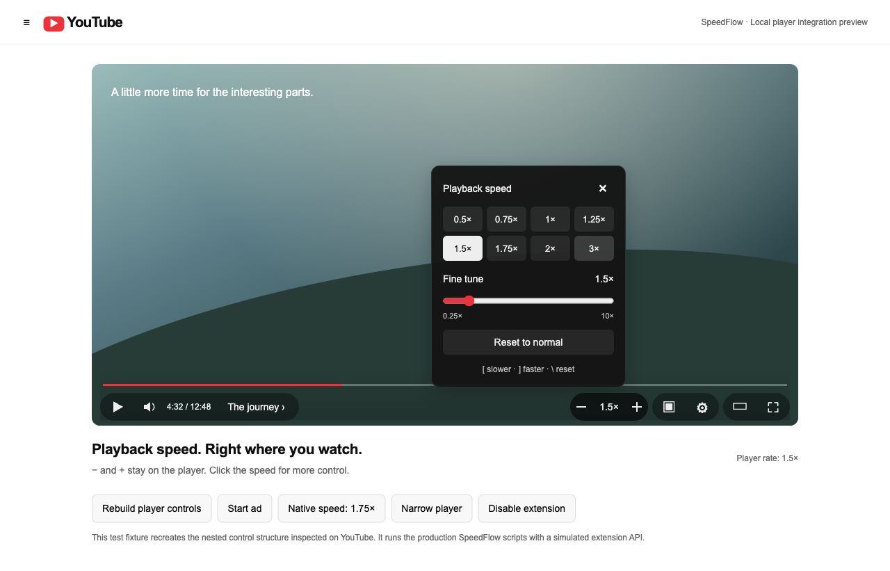

# SpeedFlow

### Playback speed. Right where you watch.

A lecture at 1.5×. A tricky explanation at 0.75×. A quick return to normal. SpeedFlow puts **− · speed · + directly on the YouTube player**, so changing pace takes one click instead of a trip through Settings.

**[Download the source ZIP](https://github.com/priyanshubuild/speedflow/archive/refs/heads/main.zip)** · [Installation](#install-in-chrome--step-by-step) · [Browser support](#browser-support) · [Report a problem](https://github.com/priyanshubuild/speedflow/issues)

## Why use it?

- **Controls in front.** Decrease, current speed, and increase sit beside YouTube's existing player buttons. The essential controls never live inside Settings.
- **A familiar fit.** White icons, understated hover feedback, and the player's own font, color, and button height. No oversized floating badge, extra toolbar, or forced sound effects.
- **More control when you want it.** Click the speed readout for eight presets, a 0.25×–10× slider, and a reset button.
- **Keyboard friendly.** Use `[` to slow down, `]` to speed up, and `\` to reset. Typing fields and browser shortcuts are left alone.
- **Your next video, your pace.** Remember speed across YouTube tabs in the same browser profile, or switch remembering off for a temporary choice.
- **Private by design.** No accounts, analytics, external requests, or runtime dependencies. Preferences stay in the extension's local browser storage.

YouTube's own speed controls still work: SpeedFlow accepts their changes instead of overriding them. Adjustments pause during detected ad breaks and resume afterward.

## Preview



*The preview uses a local test player based on the live YouTube control structure inspected on October 3, 2026. It runs SpeedFlow's production UI code; it is not a screenshot of an installed extension on YouTube.*

## Browser support

SpeedFlow uses Manifest V3 and standard WebExtension APIs, with both `chrome` and `browser` namespaces. A source ZIP is not an installer for every browser.

| Browser | Installation route | Status |
| --- | --- | --- |
| **Chrome** | Extract the source ZIP, then **Load unpacked**. | Primary target. |
| **Edge, Brave, Opera, Vivaldi** | Load the same folder through the browser's extension developer tools. | Chromium compatibility targets; browser-specific installation still needs manual verification. |
| **Firefox 140+** | Load `manifest.json` temporarily, or generate the Firefox package. | Firefox API path covered by automated tests; no signed release published. |
| **Safari** | Package the Safari source using Apple's tools, then build and install the resulting app. | Source prepared for conversion; a built, signed Safari app is not included or verified. |
| **Mobile browsers / YouTube app** | Browser and extension support varies. | Outside this desktop release's support scope. |

Regular YouTube videos, theater/fullscreen player layouts, and permitted YouTube embeds use the same widget. Embed access covers `www.youtube.com` and the privacy-enhanced `www.youtube-nocookie.com` player. Embedded-page and fullscreen behavior should also be checked in your target browser. **YouTube Shorts, casting, and controls inside an operating system's Picture-in-Picture window are not supported.**

## Install in Chrome — step by step

You only need desktop Chrome. **No terminal, Node.js, Python, or build step is needed to use the extension.**

### 1. Download the ZIP

1. Open the [SpeedFlow repository](https://github.com/priyanshubuild/speedflow).
2. Select the **main** branch.
3. Click the green **Code** button above the file list.
4. Choose **Download ZIP** and wait for `speedflow-main.zip` to download.

Or use the [direct ZIP download](https://github.com/priyanshubuild/speedflow/archive/refs/heads/main.zip).

### 2. Extract the ZIP

Chrome loads a folder of files, so extract the ZIP first:

- **Windows:** Right-click `speedflow-main.zip` → **Extract All…** → **Extract**.
- **macOS:** Double-click the ZIP in Finder.
- **Linux:** Open the ZIP in your archive manager and choose **Extract**.

Move the extracted `speedflow-main` folder somewhere permanent, such as `Documents/SpeedFlow`. Keep this folder while the extension is installed.

Open it and confirm that `manifest.json`, `core.js`, `content.js`, `content.css`, and `popup.html` are directly inside. If there is another folder inside the extracted folder, open that inner folder until you see `manifest.json`.

### 3. Open the Extensions page

In Chrome's address bar, type **`chrome://extensions`** and press **Enter**.

### 4. Enable Developer mode

Turn on **Developer mode** in the upper-right corner. The **Load unpacked** button should appear.

### 5. Load the extracted folder

1. Click **Load unpacked**.
2. Navigate to the extracted folder in its permanent location.
3. Select the **folder containing `manifest.json`**.
4. Confirm with **Select Folder**, **Select**, or **Open**.
5. Check that the **SpeedFlow** card appears and its switch is on.

Choose the folder, not the ZIP and not a single file. You do not need to edit any files. These steps follow [Chrome's official unpacked-extension guide](https://developer.chrome.com/docs/extensions/get-started/tutorial/hello-world#load-unpacked).

### 6. Open a video

1. Visit [YouTube](https://www.youtube.com/) and open a regular video.
2. **Refresh any YouTube tabs that were open before installation.**
3. Move your pointer over the video to reveal the control bar.
4. Find **− · 1× · +** beside YouTube's existing buttons.
5. Click **+** once: the displayed speed and video playback should become **1.25×**.

The controls follow the player bar's visibility. On very narrow players, they move into a compact row just above it so they do not cover native buttons.

### 7. Pin the toolbar button (optional)

Click the browser's **Extensions** puzzle-piece button, find **SpeedFlow**, and click its pin. The toolbar popup offers another way to change speed, enable or pause the extension, and manage preferences.

## Install in other browsers

### Edge, Brave, Opera, and Vivaldi

Download and extract the same source ZIP. Open the browser's extension management page (for example, `edge://extensions` or `brave://extensions`), enable Developer mode, and choose **Load unpacked**. Select the folder containing `manifest.json`, then refresh YouTube. Labels and page addresses may differ by browser version.

### Firefox — temporary installation

1. Download and extract the source ZIP.
2. Open `about:debugging#/runtime/this-firefox` in Firefox.
3. Click **Load Temporary Add-on…**.
4. Select the extracted **`manifest.json` file**.
5. Grant the requested YouTube site access if Firefox prompts you, then refresh YouTube.

This installation is for testing and **ends when Firefox restarts**. Permanent installation requires a Mozilla-signed add-on. The packaging script below supplies a stable Firefox extension ID and declares that no data is collected. See [Mozilla's temporary-installation instructions](https://developer.mozilla.org/en-US/docs/Mozilla/Add-ons/WebExtensions/Your_second_WebExtension) and [Firefox manifest requirements](https://developer.mozilla.org/en-US/docs/Mozilla/Add-ons/WebExtensions/manifest.json/browser_specific_settings).

### Safari — source conversion

Safari requires an app wrapper; **Load unpacked is not a Safari installation method**. On a Mac with the appropriate Apple development tools, first generate the Safari source folder as described below, then follow [Apple's Safari extension packaging guide](https://developer.apple.com/documentation/safariservices/packaging-a-web-extension-for-safari). Build, sign, and enable the generated Safari extension using Apple's workflow. This repository does not provide a ready-to-install Safari app.

## Use SpeedFlow

| Control | Action |
| --- | --- |
| **−** on the player | Decrease speed by 0.25×. |
| **+** on the player | Increase speed by 0.25×. |
| **Current speed** on the player | Open presets and the fine-tuning slider. |
| **Reset to normal** in the speed panel or toolbar popup | Return to 1×. |
| `[` / `]` | Decrease / increase by 0.25×. |
| `\` (backslash) | Return to 1× immediately. |

The range is **0.25× to 10×**, subject to what the browser and video can play. A soft-spoken tutorial may work best slower; a familiar lecture may be comfortable faster. At high rates, some browsers can mute audio or struggle to decode video. If a rate is rejected, SpeedFlow keeps the previous setting and announces the problem.

### Preferences

Open the SpeedFlow toolbar popup:

- **Enable SpeedFlow:** Show or pause the extension. Disabling it removes the widget and restores the video's original rate when it can do so outside an ad break.
- **Remember my speed:** Save the speed locally and share changes between supported tabs in this browser profile. Turn it off to keep future adjustments in the current tab; newly loaded pages start at 1×. Turning it off does not delete a previously saved value, but ignores it while remembering is off.
- **Keyboard shortcuts:** Enable or disable the three single-key shortcuts. They do not run while typing, using the speed slider, composing text, or holding Ctrl, Command, Alt, or Shift.

### Accessibility

Use **Tab** to reach the three player buttons, then **Enter** or **Space** to activate them. Press **Arrow Down** on the speed readout to open the panel. Inside it, Tab reaches presets, the labeled native range slider, reset, and close controls. Use arrow keys on the slider; press **Escape** to close the panel and return focus to the speed readout.

Controls have descriptive accessible names, selected preset states, announced speed changes, and visible keyboard focus. The interface respects reduced motion and offers system-color styling in forced-colors mode. Controls remain visible while the SpeedFlow panel or player buttons hold focus. On short players, the panel scrolls to keep its contents available.

These features have automated coverage and browser fixture checks. They do not replace testing with your actual screen reader, browser, and assistive technology.

## Troubleshooting

| Problem | What to do |
| --- | --- |
| **Manifest file is missing or unreadable** | Fully extract the ZIP. Select the folder that directly contains `manifest.json`. |
| **Load unpacked** is missing | Enable Developer mode. Work or school browser policy may block developer extensions. |
| No player controls | Enable SpeedFlow, check its YouTube site access, refresh the tab, and open a regular video. Move your pointer over the player. |
| Controls are dimmed during an ad | Wait for the ad to finish. SpeedFlow preserves your selected speed. |
| The toolbar cannot connect | Refresh the YouTube tab or use **Reconnect to video** in the popup. Check site access. |
| Shortcuts do nothing | Leave search/comment fields, focus the video page, and enable shortcuts in the popup. Keyboard layout may change which physical keys produce `[`, `]`, and `\`. |
| Speed does not persist | Enable **Remember my speed**. Preferences are local to each browser/profile; clearing extension data or reinstalling can reset them. |
| Another extension keeps changing speed | Disable other playback controllers while checking SpeedFlow. Multiple controllers can conflict. |
| Playback is silent or uneven at high speed | Try a lower rate; decoding and audio behavior depend on the browser and media. |
| An embed has no widget | Verify the embed is from a permitted YouTube origin and that the browser grants the extension access to it. |
| Extension files disappeared | Restore the permanent folder, or remove the installation and load its new folder again. |

If a problem remains, [open an issue](https://github.com/priyanshubuild/speedflow/issues) with your browser/version, operating system, playback mode, reproduction steps, and any extension error message. Include only information you are comfortable sharing publicly.

YouTube changes its layout over time. SpeedFlow watches for replacement controls and videos and remounts after navigation, but no third-party extension can promise to work with every future layout or browser.

## Update or remove

**Update:** Download the newest ZIP, extract it, and replace the files in the same permanent folder. Go to the extension management page, click **Reload** on SpeedFlow, and refresh open YouTube tabs. Unpacked installs do not automatically update from GitHub. Version 3 uses extension storage; a speed saved by version 2 in YouTube site data is not imported automatically.

**Disable:** Turn off **Enable SpeedFlow** in its popup to stop it immediately, or disable it in the browser's extension management page and refresh YouTube.

**Remove:** Remove SpeedFlow from the browser's extension management page, then refresh open YouTube tabs to clear already-injected controls. You can then delete the extracted folder. Version 3 does not write preferences into YouTube site data; any old version 2 `sf_speed` preference may remain there.

## Privacy and permissions

- **`storage`:** Store only speed, enabled state, remembering, and shortcut preferences locally in the extension.
- **`scripting`:** Reconnect an already-open YouTube tab by loading the bundled code and styles when needed.
- **YouTube host access:** Mount and operate player controls on `https://www.youtube.com/*` and `https://www.youtube-nocookie.com/embed/*`.

There is no broad `tabs` permission, background worker, tracking, remote script, account, or external network request in the extension code. Querying the active tab is restricted by the available host permissions. Content scripts run in the [browser's isolated extension context](https://developer.chrome.com/docs/extensions/develop/concepts/content-scripts), rather than inside YouTube's page script context. Browser storage is local preference storage, not encryption or cross-browser sync.

## Develop and package

Installing from source does not require these tools. For contributors, use the full source repository (rather than a small browser package), Node.js 20+ for tests, and Python 3.10+ for packaging.

```sh
npm ci
npm run check
npm test
python3 scripts/package.py
```

Packaging creates unpacked folders and reproducible ZIPs in `dist/`:

```text
speedflow-chromium/                 # Chrome / Edge / other Chromium targets
speedflow-firefox/                  # Includes Firefox manifest settings
speedflow-safari/                   # Source for Apple's packaging workflow
speedflow-chromium-3.0.0.zip
speedflow-firefox-3.0.0.zip
speedflow-safari-3.0.0.zip
```

Generate just one target with `python3 scripts/package.py --browser firefox`. Firefox archives need signing for permanent installation; Safari archives need Apple packaging. Generated files do not include tests, development dependencies, or repository metadata.

To inspect the UI locally:

```sh
python3 tests/preview_server.py
```

Open `http://127.0.0.1:8765/watch?v=preview`. The fixture offers buttons to rebuild controls, simulate an ad, change the native playback rate, and disable SpeedFlow. It tests UI behavior with a simulated extension API and an unloaded video; it does not test actual YouTube playback or browser extension permission enforcement.

### Project files

| File | Purpose |
| --- | --- |
| `manifest.json` | Common Manifest V3 configuration. |
| `core.js` | Speed validation, preference normalization, URL checks, shortcut handling. |
| `content.js` / `content.css` | Player lifecycle, playback behavior, and accessible interface. |
| `popup.html` / `popup.js` / `popup.css` | Toolbar controls, preferences, and reconnect flow. |
| `icons/` | Extension icons and editable SVG source. |
| `tests/` | Automated regression tests and local browser fixture. |
| `scripts/` | Deterministic icon generation and browser packaging. |
| `docs/VALIDATION.md` | Verification evidence and manual release checklist. |

Dependencies are for development only. The installed extension runs on plain JavaScript and CSS.

SpeedFlow is an independent project and is not affiliated with or endorsed by YouTube or Google.
