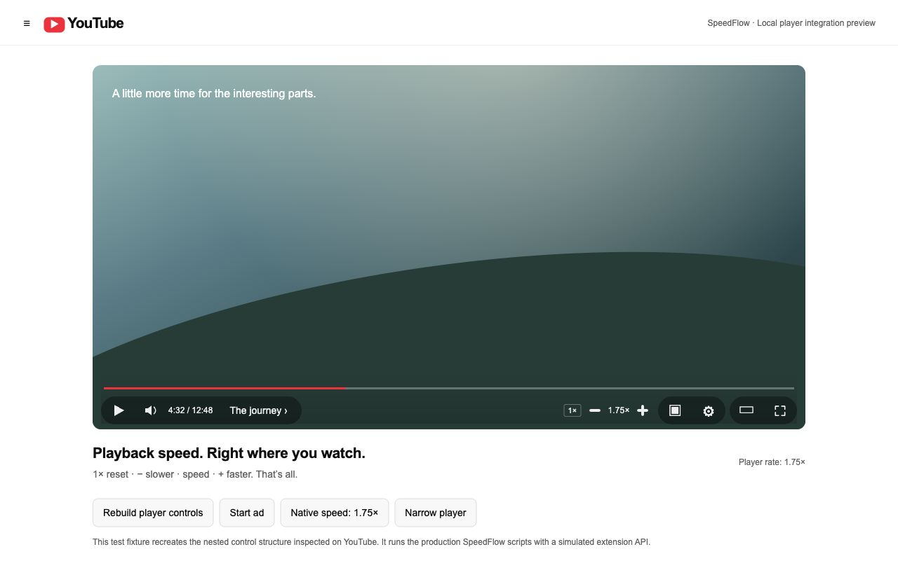

# SpeedFlow

Simple speed controls on the YouTube player:

**1× reset · − slower · current speed · + faster**

The font, color, and spacing fit the player. No popup or extra menu. Your speed is saved locally for your next video.

## Install in Chrome

1. **[Download the ZIP](https://github.com/priyanshubuild/speedflow/archive/refs/heads/main.zip).** You can also click **Code → Download ZIP** on this repository.
2. **Extract the ZIP.** On Windows, right-click → **Extract All**. On Mac, double-click it. On Linux, choose **Extract** in your archive manager.
3. Move the extracted `speedflow-main` folder somewhere permanent. Keep it while the extension is installed.
4. Open **`chrome://extensions`** in Chrome.
5. Turn on **Developer mode** in the top-right corner.
6. Click **Load unpacked** and select the extracted **folder containing `manifest.json`**. Select the folder, not the ZIP or a single file.
7. Open a regular YouTube video, or refresh an already-open video tab.
8. Move your pointer over the video. Find the speed controls beside the player buttons and click **+** to try **1.25×**.

You do not need to edit code or install any development tools.

## Use it

| Control | What it does |
| --- | --- |
| **1×** on the left | Reset to normal speed. Appears when speed is different from 1×. |
| **−** | Slow down by 0.25×. |
| **Speed** | Shows the current rate. Does not open a menu. |
| **+** | Speed up by 0.25×. |

Keyboard: **`[`** slower · **`]`** faster · **`\`** reset. Shortcuts pause while you type. You can also use **Tab**, then **Enter** or **Space**, to activate a button.

Speed range: **0.25×–10×**, depending on what the browser and video can play. Controls pause during detected ads and resume afterward. YouTube's own speed settings still work.



*Preview from a local test player running the extension's code.*

## Other browsers

- **Edge, Brave, Opera, Vivaldi:** Use the same extracted folder and the browser's **Load unpacked** option.
- **Firefox:** Open `about:debugging#/runtime/this-firefox` → **Load Temporary Add-on** → select `manifest.json`. This lasts until Firefox restarts; permanent installation requires signing.
- **Safari:** Requires Apple's extension packaging tools. A ready-to-install Safari app is not included.

Chrome is the primary target. Other browsers still need installed-extension testing. YouTube Shorts, the YouTube app, casting, and operating-system Picture-in-Picture controls are not supported.

## Update or remove

**Update:** Download and extract the latest ZIP. Replace the files in your extension folder, click **Reload** on its browser extensions page, then refresh YouTube. When updating from 3.0, remove the old `popup.html`, `popup.js`, and `popup.css` files.

**Disable or remove:** Use the browser's extensions page, then refresh YouTube.

**After reloading the extension:** Refresh every open YouTube tab to replace its old extension code.

**Missing controls?** Check that SpeedFlow is enabled and allowed on YouTube, refresh the page, and open a regular video. If playback struggles at high speed, lower the rate.

## Privacy

No accounts, tracking, or external requests. Only your speed is saved in local extension storage. YouTube site access is used to add the player controls.

## Development

```sh
npm ci
npm run check
npm test
python3 scripts/package.py
```

37 automated tests cover speed changes, reset, keyboard use, ads, navigation, and player replacement. Browser packages are created in `dist/`. See [validation details](docs/VALIDATION.md) for tested behavior and remaining checks.

[Report a problem](https://github.com/priyanshubuild/speedflow/issues). SpeedFlow is an independent project, not affiliated with YouTube or Google.
